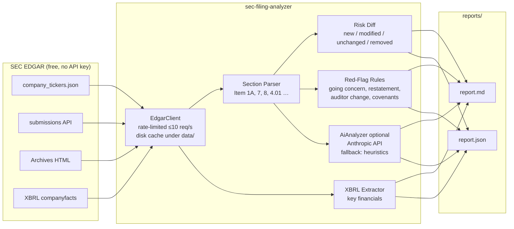

# SEC Filing Analyzer

Automated analyzer for SEC **10-K**, **10-Q** and **8-K** filings: downloads
filings from the official EDGAR APIs, splits them into canonical sections,
extracts key financials from XBRL, diffs risk factors year-over-year, detects
red flags (going-concern doubt, restatements, auditor changes, …) and writes
Markdown + JSON reports — optionally enriched by the Anthropic API.

> ⚠️ Output is for research and educational purposes. Not investment advice.

## Architecture



**Pipeline per filing:** download → parse sections → (1) summarize key
sections, (2) diff Item 1A risk factors against the prior filing,
(3) scan for red flags, (4) extract key financials from XBRL → render
Markdown + JSON report.

The AI layer is optional by design: without an `ANTHROPIC_API_KEY` the tool
falls back to deterministic heuristics (extractive summaries, similarity-based
diff, rule-based red flags), so results are reproducible and CI needs no
secrets.

## EDGAR compliance

The SEC provides EDGAR data for free but has
[access requirements](https://www.sec.gov/os/accessing-edgar-data):

- **User-Agent with contact e-mail is mandatory.** This tool refuses to start
  without a valid `SEC_USER_AGENT` environment variable (placeholders are
  rejected). The value is never hardcoded.
- **Max 10 requests/second.** A built-in rate limiter enforces this; the
  default is a conservative 5 req/s (`SEC_MAX_REQUESTS_PER_SECOND`).
- Downloads are cached under `data/` so repeated runs don't re-hit EDGAR.

## Setup

Requires Python ≥ 3.11 and [uv](https://docs.astral.sh/uv/).

```bash
git clone https://github.com/OhneisB/SEC-Filing-Analyzer.git
cd SEC-Filing-Analyzer
uv sync

cp .env.example .env
# Edit .env:
#   SEC_USER_AGENT="your-tool/1.0 (you@your-domain.com)"   <- required by the SEC
#   ANTHROPIC_API_KEY=sk-ant-...                            <- optional, enables AI analysis
```

## Usage

```bash
# Analyze the latest 10-K (summaries, red flags, XBRL financials,
# risk diff vs. the previous 10-K):
uv run sec-analyze AAPL --form 10-K

# The last four 10-Qs:
uv run sec-analyze AAPL --form 10-Q --last 4

# Explicit diff of the two most recent 10-Ks:
uv run sec-analyze AAPL --diff

# Check recent 8-Ks for auditor changes / non-reliance:
uv run sec-analyze AAPL --form 8-K --last 5

# Without AI (deterministic heuristics only):
uv run sec-analyze AAPL --form 10-K --no-ai
```

Reports land in `reports/<TICKER>/<FORM>_<period>/report.{md,json}`.

### See it without running anything

Committed example output lives in [`examples/showcase/`](examples/showcase/) —
a clean report for a healthy large-cap and a red-flag-heavy report for a
historical problem case — so you can see exactly what the tool produces
without any API key or network access.

Example red-flag output for a distressed filer:

```
Analyzing 10-K filed 2021-02-26 (0001657853-21-000010) …
  report: reports/HTZ/10-K_2020-12-31/report.md
  🚩 HIGH: Going-concern doubt
  🚩 HIGH: Bankruptcy / reorganization proceedings
  🚩 MEDIUM: Debt covenant breach / liquidity stress
```

## What the analysis produces

| Stage | Output |
|---|---|
| Section summaries | 4–6 bullet points per key item (AI) or extractive fallback |
| Risk diff | Every Item 1A risk classified **new / modified / unchanged / removed** with similarity score and excerpts |
| Red flags | Rule-based detection: going concern, restatement / non-reliance (8-K 4.02), material weakness, auditor change (8-K 4.01), unusual accounting changes, covenant breaches, bankruptcy |
| Key financials | Revenue, operating/net income, EPS, assets, liabilities, equity, operating cash flow from XBRL with concept provenance |

## Validation

`evals/` contains a historical validation suite (see
[evals/README.md](evals/README.md)): XBRL figures are checked against
officially reported values, the risk diff against known year-over-year
changes, and red-flag detection against a real problem case — **Hertz
Global Holdings FY2020** (Chapter 11, going-concern doubt). CI runs the
offline fixture mode; `--live` runs the same checks against real EDGAR data
for AAPL, MSFT, JNJ, KO and HTZ.

```bash
uv run python evals/run_evals.py          # offline, no network
uv run python evals/run_evals.py --live   # real EDGAR data
```

## Development

```bash
uv sync --group dev
uv run pytest                       # unit tests, cached fixtures, no live calls
uv run python evals/run_evals.py    # offline eval suite
uv run python docs/build_pdf.py     # regenerate docs/dokumentation.pdf (German)
```

Tests never hit the network: the EDGAR client is exercised against cached
fixture responses, matching how the GitHub Actions workflow runs.

## Optional n8n backend (advanced)

If outbound access to sec.gov is blocked in your environment, requests can be
routed through your **own** self-hosted [n8n](https://n8n.io) proxy instead of
calling EDGAR directly:

```bash
uv run sec-analyze AAPL --form 10-K --backend n8n
# needs, in your local .env (never committed):
#   SEC_BACKEND=n8n
#   N8N_WEBHOOK_URL=https://your-n8n-host/webhook/edgar-proxy
#   N8N_AUTH_TOKEN=your-long-random-secret
```

The same caching, rate-limiting and parsing logic runs over either backend.
A sanitized example workflow and full instructions are in
[`examples/n8n/`](examples/n8n/). This is **opt-in and illustrative**: no
endpoint, URL or token ships in this repo, the webhook must require a Bearer
token, and the proxy only fetches `sec.gov` URLs.

## Security & scope

This is a showcase / research project, not a hosted service.

- **No secrets in the repo.** `ANTHROPIC_API_KEY`, `SEC_USER_AGENT` and the
  optional n8n URL/token come exclusively from your environment (`.env`, which
  is git-ignored). The repo ships only `.env.example` with placeholders.
- **Bring your own keys.** There is no shared or hosted endpoint; running the
  tool live uses *your* credentials, so no one can consume a maintainer's API
  credits.
- **Works fully offline.** Tests, the eval suite and the committed showcase
  reports run without any key or network access.

## Documentation

- [`docs/dokumentation.pdf`](docs/dokumentation.pdf) — German deep-dive:
  how EDGAR and XBRL work, the analysis pipeline, how to read the diff
  report and red flags, and the tool's limitations.

## Limitations

- Section extraction is heuristic; exotic filing layouts may yield
  incomplete sections.
- XBRL concept mapping covers common us-gaap tags; company-specific tagging
  can require extending `CONCEPT_MAP`.
- Red-flag rules are precision-oriented keyword patterns — they flag
  candidates, they don't replace reading the filing.
- AI summaries can be imperfect; the JSON report always contains the
  underlying deterministic data.

## License

[MIT](LICENSE)
