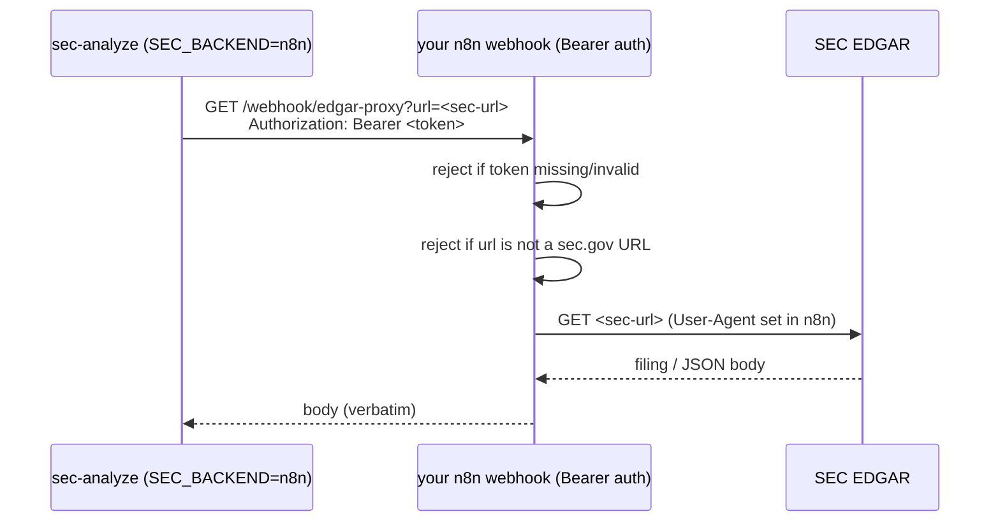

# Optional n8n proxy backend

This directory illustrates **how** the analyzer can fetch EDGAR data through a
self-hosted [n8n](https://n8n.io) workflow instead of calling sec.gov directly.
It exists for environments where outbound access to sec.gov is blocked.

> This is an **illustration only**. No hosted endpoint, URL, token or
> credential ships in this repository. There is nothing here that lets anyone
> call a maintainer's instance or spend a maintainer's API credits. To use it
> you stand up your **own** n8n instance and supply your **own** secrets via
> the environment.

## How it works



The analyzer's `N8nBackendSession` mimics the tiny `requests.Session` surface
the EDGAR client already uses, so **the same** caching, rate-limiting and
parsing logic runs regardless of backend.

## Setup

1. Import [`edgar-proxy.workflow.json`](edgar-proxy.workflow.json) into your own
   n8n instance.
2. Create a **Header Auth** credential (`Authorization: Bearer <your-secret>`)
   and attach it to the Webhook node. This is what stops the proxy from being
   an open relay.
3. Set the `User-Agent` in the HTTP Request node to your real contact e-mail
   (the SEC requires this).
4. The `Validate target URL` node already restricts fetches to `sec.gov` hosts.
5. Activate the workflow and copy its production webhook URL.

Then, locally (never commit these):

```bash
# .env
SEC_BACKEND=n8n
N8N_WEBHOOK_URL=https://your-n8n-host/webhook/edgar-proxy
N8N_AUTH_TOKEN=your-long-random-secret
```

```bash
uv run sec-analyze AAPL --form 10-K --backend n8n
```

## Security checklist

- [x] No URL or token in the repo — both come from the environment.
- [x] Webhook requires a Bearer token (not an open relay).
- [x] Proxy only fetches `sec.gov` URLs (SSRF guard).
- [x] SEC contact e-mail lives in the n8n node, not in client code.
- [x] Default backend stays `edgar`; n8n is strictly opt-in.
